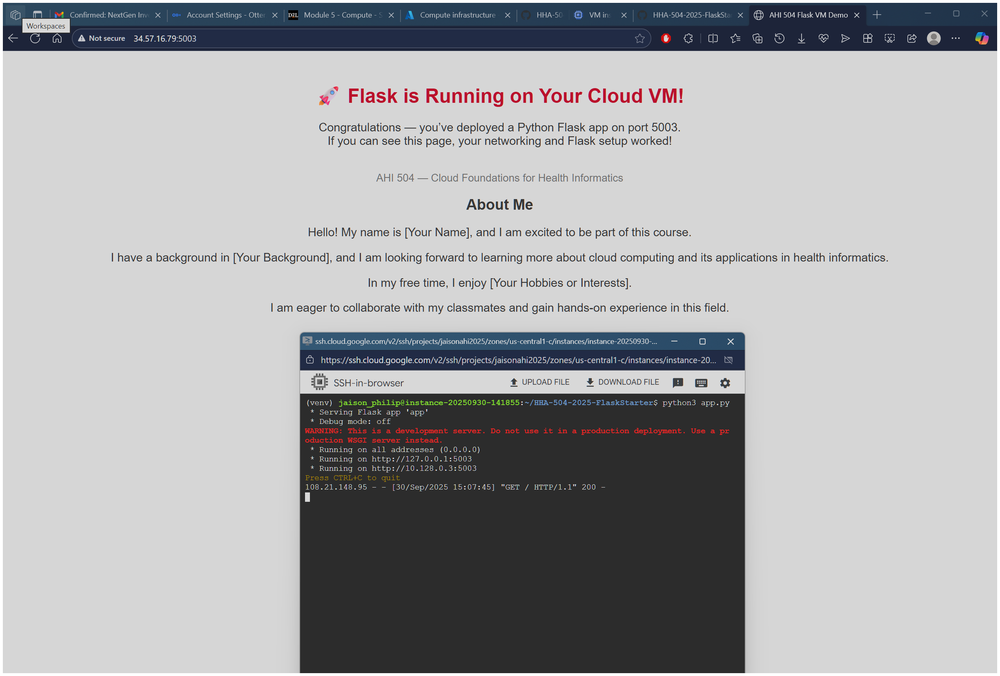

# cloud_vm_networking_flask
Assignment 2 Flask on Cloud VM

Flask on Cloud VM (Assignment 2)
Student Info
Name:

Cloud Provider:

Video recording:

Zoom/Loom:

Steps
## 1. VM Creation

2. Networking (Port 5003 Open)

3. OS Update + Python Install

4. Flask App Running

5. Public IP Access
URL: http://XX.XX.XXX.XXX:5003
[screenshot]

6. (Bonus) Domain Name
Domain: http://mydomain.tech:5003
[screenshot]